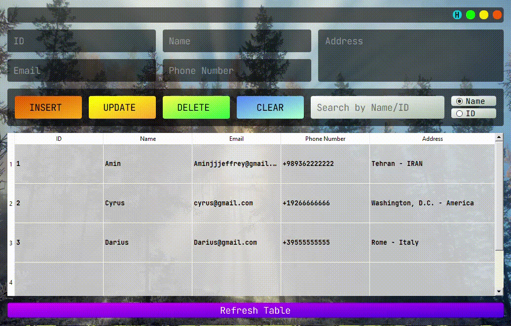

# Contact_Book
This is a simple Contactbook program built with PyQt5 and sqlite3 database, to add a new element, you need to enter the name, email, phone number, address and ID in the program and press the INSERT button, I hope you like it


# Requires

```bash
  pip install PyQt5
```
```bash
  pip install sqlite3
```

# Features 
- Update
- Delete
- Sqlite3 Database
- Search by Name and ID

# Usage/Examples
<kbd>
 
</kbd>


# Author
- Github: [@Aminjjjeffrey](https://github.com/Aminjjjeffrey)
- Twitter: [@Aminjjjeffrey](https://twitter.com/Aminjjjeffrey)


